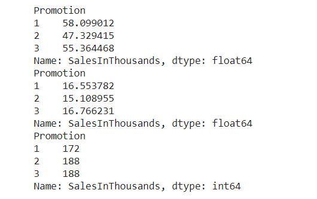

# AB testing

```py
means = df.groupby('Promotion').mean()['SalesInThousands']
stds = df.groupby('Promotion').std()['SalesInThousands']
ns = df.groupby('Promotion').count()['SalesInThousands']




t, p = stats.ttest_ind(df.loc[df['Promotion'] == 1, 'SalesInThousands'].values,
                       df.loc[df['Promotion'] == 2, 'SalesInThousands'].values, 
                       equal_var=False)
print('t-value = ' +str(t))
print('p-value = ' +str(p))


t, p = stats.ttest_ind(df.loc[df['Promotion'] == 1, 'SalesInThousands'].values, 
                       df.loc[df['Promotion'] == 3, 'SalesInThousands'].values, 
                       equal_var=False)
print("t-value = " +str(t))
print("p-value = " +str(p))
```